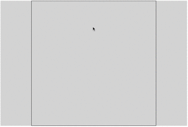

# Assignment 0:  Typescript, Web, Simple Graphics warmup 

## Overview 

The goal of this assignment is have you get experience with Typescript, create a simple data structure common in graphics (a circular buffer), gain experience with the common structure of interactive graphical program (not just on the web), and ensure your development and debugging environments are set up.

The result should look like this:



In particular:

1. a0.ts contains a lot of the code for this example, you should complete it.
2. pointset.ts is mostly empty, you need to implement the main PointSet class that is used by the application in a0.ts
3. PointSet should be implemented as a circular buffer, as described in the comments in the file.  The key feature of a circular buffer is that the contents of the buffer are never moved or copied as new elements are added or removed.  Instead, the index markers for the start and end are updated.  The interface methods of the class hide the implementation details from the programmer: they can simply request the first, second, third, etc. element as desired.
4. the program should create one "point" per animationFrame and store 30 points (1 second worth of data at 30 frames per second).  The points should be rendered such that they appear to fade out as the mouse moves.  New points should not be created when the mouse is outside of the canvas, but old ones should continue to disappear.
5. when the user clicks and drags, a grey hollow rectagle should be traced out from the start point to the current mouse location.  If the user releases the button, a rectangle of random color should be created.  If the user moves the mouse out of the canvas, the rectangle creation should be canceled.
6. the canvas should be redrawn each animation frame, and nothing should be drawn in the canvas outside of the render function.


Please test that your submission meets these requirements.  For example, once you create your zip file, extract it into a new folder and test these steps.
 
# Development Environment

The sample has already been set up with a complete project for Typescript development.

To work with this sample and prepare your submission, you should have Node (and in particular, npm) installed, which you can retrieve from [nodejs.org](http://nodejs.org).   

In addition to node, you should make sure Typescript is installed, as described at [www.typescriptlang.org](http://www.typescriptlang.org).

## Running 

You can compile the typescript to javascript and then open the html file in your web browser to run:
```
tsc
open a0.html   // on a mac
```

The project also includes a simple gulpfile.js to run a simple gulp-connect web server to serve up the files in this directory.  To use it, you must install all the required npm packages, and then run gulp to build the project and run the server:
```
npm install
gulp
```

You can run the sample by pointing your web browser at ```http://localhost:8080/a0.html```
